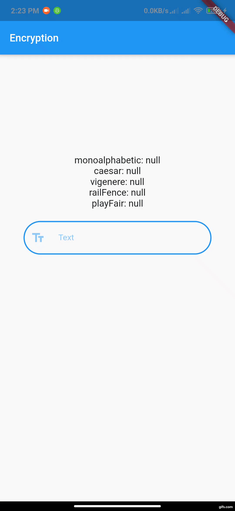

# Encryption App

A new Flutter project.

## Getting Started

- in that project i created 5 Encryption methods "monoalphabetic", "caesar", "vigenere", "playFair" and "railFence"

## Picture of app

  

## use App
- download code and run it
- write anything in TextFile and it will encrypt automatic and will see the text after encryption
